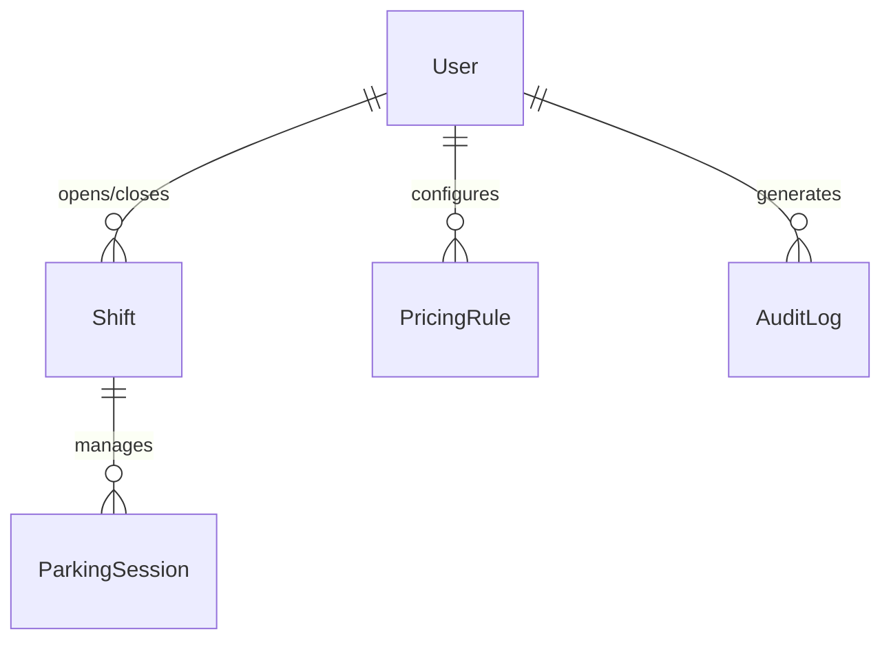

# Parking Garage Management System — Project Plan

> **Version:** 1.0  
> **Scope:** 5-gate parking garage with operator POS terminals and admin oversight.  
> **Read alongside:** `constitution.md` — all decisions here conform to its rules.

---

## 1. High-Level Architecture Overview
```text
┌─────────────────────────────────────────────────────────────────┐
│                          CLIENT LAYER                           │
│                                                                 │
│  ┌──────────────────────┐         ┌──────────────────────────┐  │
│  │ Operator UI          │         │ Admin Dashboard          │  │
│  │ (Sunmi V2 POS)       │         │ (Desktop Browser)        │  │
│  ├──────────────────────┤         ├──────────────────────────┤  │
│  │ Jinja2 + Tailwind    │         │ Jinja2 + Tailwind        │  │
│  │ RTL / Arabic         │         │ Charts + Tables          │  │
│  │ 58mm Print CSS       │         │ Reports & Exports        │  │
│  └──────────┬───────────┘         └────────────┬─────────────┘  │
└─────────────┼──────────────────────────────────┼────────────────┘
              │       HTTP (LAN / localhost)     │
┌─────────────▼──────────────────────────────────▼────────────────┐
│                      FASTAPI APPLICATION                        │
│                                                                 │
│  ┌───────────────────────────────────────────────────────────┐  │
│  │ Routes Layer                                              │  │
│  │ /ui/* (HTML)                    /api/v1/* (JSON)          │  │
│  │ auth, tickets,                  auth, tickets,            │  │
│  │ operator pages                  sessions, rates, reports  │  │
│  └────────────────────────────┬──────────────────────────────┘  │
│                               │                                 │
│  ┌────────────────────────────▼──────────────────────────────┐  │
│  │ Services Layer                                            │  │
│  │ AuthService      TicketService      PricingService        │  │
│  │ ShiftService        PlateService       ReportService      │  │
│  └────────────────────────────┬──────────────────────────────┘  │
│                               │                                 │
│  ┌────────────────────────────▼──────────────────────────────┐  │
│  │ Repositories Layer                                        │  │
│  │ UserRepo         SessionRepo        ShiftRepo    RateRepo │  │
│  └────────────────────────────┬──────────────────────────────┘  │
│                               │                                 │
│  ┌────────────────────────────▼──────────────────────────────┐  │
│  │ SQLAlchemy ORM (Async)                                    │  │
│  └────────────────────────────┬──────────────────────────────┘  │
└───────────────────────────────┼─────────────────────────────────┘
                                │
┌───────────────────────────────▼─────────────────────────────────┐
│                           DATA LAYER                            │
│                                                                 │
│ SQLite (dev) ────── switchable via DATABASE_URL ──── PostgreSQL │
└─────────────────────────────────────────────────────────────────┘
```

### Key Architectural Decisions

| Concern | Decision | Reason |
|---|---|---|
| Rendering | Server-side Jinja2 | Sunmi V2 is resource-constrained; no SPA overhead |
| API | REST JSON under `/api/v1/` | Clean separation; future mobile app compatibility |
| Auth | JWT in HttpOnly cookie | Works on POS browser; no localStorage dependency |
| Pricing | Integer piastres only | Eliminates floating-point money bugs |
| Barcode & Plate | Barcode (required) + Plate (optional) | Barcode is primary lookup; plate number is optional and normalized on write |
| DB access | Async SQLAlchemy sessions | Non-blocking; consistent with FastAPI async model |
| Print | `window.print()` + `print.css` | No driver installation needed on Sunmi V2 |

---

## 2. Database Schema

### 2.1 Entity Relationship Overview



### 2.2 Model Definitions

---

#### `users` — Operators and Admins

```
users
├── id INTEGER PK AUTO
├── full_name VARCHAR(120) NOT NULL
├── username VARCHAR(60) UNIQUE NOT NULL
├── hashed_password VARCHAR(255) NOT NULL
├── role ENUM('admin', 'operator') NOT NULL
├── gate_number SMALLINT NULLABLE -- assigned gate (1–5); NULL for admins
├── is_active BOOLEAN DEFAULT TRUE
├── created_at TIMESTAMP NOT NULL
└── updated_at TIMESTAMP NOT NULL
```
**Rules:**
- `role = 'operator'` must have a `gate_number` between 1 and 5.
- `role = 'admin'` has `gate_number = NULL` and full system access.
- Passwords are hashed with bcrypt; plaintext never touches the database.

---

#### `shifts` — Operator Work Sessions

```
shifts
├── id INTEGER PK AUTO
├── operator_id INTEGER FK → users.id NOT NULL
├── gate_number SMALLINT NOT NULL -- snapshot at shift start
├── started_at TIMESTAMP NOT NULL
├── ended_at TIMESTAMP NULLABLE -- NULL = shift in progress
├── opening_cash_egp INTEGER NOT NULL DEFAULT 0 -- in piastres
├── closing_cash_egp INTEGER NULLABLE -- in piastres; set on shift end
├── notes TEXT NULLABLE
├── created_at TIMESTAMP NOT NULL
└── updated_at TIMESTAMP NOT NULL
```
**Rules:**
- An operator may only have one open shift (`ended_at IS NULL`) at a time.
- `closing_cash_egp` is set by the operator at shift end; admin can override.
- All financial totals for a shift are computed from `parking_sessions` joined on `shift_id`.

---

#### `pricing_rules` — Hourly Rate Configuration

```
pricing_rules
├── id INTEGER PK AUTO
├── label VARCHAR(100) NOT NULL -- e.g., "Standard Rate", "Night Rate"
├── rate_per_hour INTEGER NOT NULL -- piastres per hour
├── minimum_charge INTEGER NOT NULL DEFAULT 0 -- minimum fee in piastres
├── grace_period_mins SMALLINT NOT NULL DEFAULT 15 -- free minutes before billing starts
├── is_active BOOLEAN DEFAULT FALSE -- only one rule active at a time
├── created_by INTEGER FK → users.id NOT NULL
├── effective_from TIMESTAMP NOT NULL
├── effective_until TIMESTAMP NULLABLE -- NULL = open-ended
├── created_at TIMESTAMP NOT NULL
└── updated_at TIMESTAMP NOT NULL
```
**Rules:**
- Only one pricing rule may be `is_active = TRUE` at a time. Enforced at service layer.
- Rate changes are non-destructive: old rules are kept for historical session pricing.
- `PricingService` resolves the active rule at the moment a session ends, not when it begins.

---

#### `parking_sessions` — Core Transactional Record

```
parking_sessions
├── id INTEGER PK AUTO
├── ticket_number VARCHAR(20) UNIQUE NOT NULL -- generated: GATE-YYYYMMDD-SEQ
├── card_barcode VARCHAR(50) NOT NULL -- card barcode scanned at entry/exit
├── plate_number VARCHAR(30) NULLABLE -- canonical: "ن ي ش 159" (optional)
├── gate_number SMALLINT NOT NULL -- entry gate
├── shift_id INTEGER FK → shifts.id NOT NULL
├── operator_id INTEGER FK → users.id NOT NULL -- entry operator (snapshot)
├── entry_time TIMESTAMP NOT NULL
├── exit_time TIMESTAMP NULLABLE -- NULL = car still inside
├── duration_minutes INTEGER NULLABLE -- computed on exit, stored for audit
├── pricing_rule_id INTEGER FK → pricing_rules.id NULLABLE
├── amount_charged INTEGER NULLABLE -- piastres; NULL until exit
├── payment_method ENUM('cash') DEFAULT 'cash' -- extensible for future methods
├── is_paid BOOLEAN DEFAULT FALSE
├── exit_operator_id INTEGER FK → users.id NULLABLE -- may differ from entry operator
├── exit_shift_id INTEGER FK → shifts.id NULLABLE
├── receipt_printed_at TIMESTAMP NULLABLE
├── is_deleted BOOLEAN DEFAULT FALSE -- soft delete only
├── notes TEXT NULLABLE
├── created_at TIMESTAMP NOT NULL
└── updated_at TIMESTAMP NOT NULL
```
**Rules:**
- `ticket_number` format: `G{gate}-{YYYYMMDD}-{5-digit sequence}`. Example: `G3-20240815-00042`.
- `duration_minutes` and `amount_charged` are computed by `PricingService` at exit and stored permanently — they must not be recomputed after the fact.
- A session with `is_paid = TRUE` and `exit_time NOT NULL` is considered closed and immutable.
- Searching by plate must use normalized form via `PlateService` before querying (if plate is used).
- `card_barcode` must be unique among active sessions (where `exit_time IS NULL`) to prevent duplicate entry of the same card.

---

#### `audit_logs` — Immutable Action Trail
```
audit_logs
├── id INTEGER PK AUTO
├── actor_id INTEGER FK → users.id NOT NULL
├── action VARCHAR(80) NOT NULL -- e.g., "SESSION_CREATED", "RATE_CHANGED"
├── entity_type VARCHAR(40) NOT NULL -- e.g., "parking_session", "pricing_rule"
├── entity_id INTEGER NOT NULL
├── payload_before JSONB / TEXT NULLABLE -- state before change
├── payload_after JSONB / TEXT NULLABLE -- state after change
└── created_at TIMESTAMP NOT NULL -- no updated_at; logs are immutable
```
**Rules:**
- This table is append-only. No UPDATE or DELETE is ever issued against it.
- Logged automatically by services via a shared `AuditService.log()` call.
- Actions to always log: session create, session close, payment record, rate change, shift open, shift close, user create/deactivate.

---

### 2.3 Relationship Summary

| Relationship | Type | Notes |
|---|---|---|
| User → Shifts | One-to-Many | One operator, many shifts over time |
| Shift → ParkingSessions | One-to-Many | All sessions opened during a shift |
| PricingRule → ParkingSessions | One-to-Many | Rule snapshotted at exit time |
| User → AuditLogs | One-to-Many | Every logged action tied to an actor |
| ParkingSession → exit operator | Many-to-One (nullable) | Exit may be a different operator |

---

## 3. API Endpoints Outline

All JSON endpoints: prefix `/api/v1/`  
All HTML operator/admin pages: prefix `/ui/`  
Auth: JWT in `HttpOnly` cookie named `pgms_token`

---

### 3.1 Authentication

| Method | Path | Auth | Description |
|---|---|---|---|
| `POST` | `/api/v1/auth/login` | Public | Accepts `username` + `password`; returns JWT cookie |
| `POST` | `/api/v1/auth/logout` | Required | Clears JWT cookie |
| `GET` | `/api/v1/auth/me` | Required | Returns current user profile and role |
| `GET` | `/ui/login` | Public | Login page (HTML) |

---

### 3.2 Operator UI Pages (HTML)

| Method | Path | Role | Description |
|---|---|---|---|
| `GET` | `/ui/operator/dashboard` | operator | Gate dashboard: open shift status, today's count |
| `GET` | `/ui/operator/shift/start` | operator | Start shift form |
| `POST` | `/ui/operator/shift/start` | operator | Submit shift start |
| `GET` | `/ui/operator/shift/end` | operator | End shift form with cash reconciliation |
| `POST` | `/ui/operator/shift/end` | operator | Submit shift close |
| `GET` | `/ui/operator/entry` | operator | Car entry form (barcode scan + optional plate input) |
| `POST` | `/ui/operator/entry` | operator | Submit car entry; redirects to session detail |
| `GET` | `/ui/operator/exit` | operator | Car exit lookup form |
| `POST` | `/ui/operator/exit/lookup` | operator | Search session by barcode, plate, or ticket number |
| `GET` | `/ui/operator/exit/{session_id}` | operator | Exit confirmation + price preview |
| `POST` | `/ui/operator/exit/{session_id}/confirm` | operator | Confirm exit + mark paid |
| `GET` | `/ui/operator/receipt/{session_id}` | operator | Printable 58mm receipt (print.css) |

---

### 3.3 Parking Sessions API

| Method | Path | Role | Description |
|---|---|---|---|
| `POST` | `/api/v1/sessions/` | operator | Create new parking session (requires `card_barcode`, optional `plate_number`) |
| `GET` | `/api/v1/sessions/` | admin | List all sessions; filterable by date, gate, status |
| `GET` | `/api/v1/sessions/{id}` | operator, admin | Get session detail |
| `GET` | `/api/v1/sessions/lookup` | operator | Search by `barcode`, `plate`, or `ticket_number` query param |
| `PATCH` | `/api/v1/sessions/{id}/exit` | operator | Record exit: computes duration + price, marks paid |
| `GET` | `/api/v1/sessions/{id}/receipt` | operator | Returns receipt data payload (JSON) |
| `GET` | `/api/v1/sessions/active` | admin | All currently-parked cars (no exit_time) |

---

### 3.4 Shifts API

| Method | Path | Role | Description |
|---|---|---|---|
| `POST` | `/api/v1/shifts/` | operator | Start a new shift |
| `GET` | `/api/v1/shifts/` | admin | List all shifts; filterable by operator, date, gate |
| `GET` | `/api/v1/shifts/active` | operator, admin | Get caller's current open shift |
| `GET` | `/api/v1/shifts/{id}` | operator, admin | Get shift detail with session summary |
| `PATCH` | `/api/v1/shifts/{id}/close` | operator | Close shift; submit closing cash amount |
| `GET` | `/api/v1/shifts/{id}/summary` | admin | Cash totals, session count, discrepancy report |

---

### 3.5 Pricing Rules API

| Method | Path | Role | Description |
|---|---|---|---|
| `POST` | `/api/v1/rates/` | admin | Create a new pricing rule |
| `GET` | `/api/v1/rates/` | admin | List all pricing rules (history) |
| `GET` | `/api/v1/rates/active` | operator, admin | Get currently active pricing rule |
| `PATCH` | `/api/v1/rates/{id}/activate` | admin | Set a rule as active (deactivates current) |
| `GET` | `/api/v1/rates/preview` | operator | Preview price for a given `entry_time` query param |

---

### 3.6 Users & Operators API

| Method | Path | Role | Description |
|---|---|---|---|
| `POST` | `/api/v1/users/` | admin | Create operator or admin account |
| `GET` | `/api/v1/users/` | admin | List all users |
| `GET` | `/api/v1/users/{id}` | admin | Get user detail |
| `PATCH` | `/api/v1/users/{id}` | admin | Update user info or gate assignment |
| `PATCH` | `/api/v1/users/{id}/deactivate` | admin | Soft-deactivate an operator |
| `PATCH` | `/api/v1/users/{id}/reset-password` | admin | Force password reset |

---

### 3.7 Admin Dashboard & Reports API

| Method | Path | Role | Description |
|---|---|---|---|
| `GET` | `/ui/admin/dashboard` | admin | Overview: live occupancy, today's revenue, active shifts |
| `GET` | `/ui/admin/reports/daily` | admin | Daily revenue and session report (HTML) |
| `GET` | `/ui/admin/reports/shifts` | admin | Shift reconciliation report (HTML) |
| `GET` | `/api/v1/reports/daily` | admin | Daily summary JSON; params: `date`, `gate` |
| `GET` | `/api/v1/reports/revenue` | admin | Revenue by date range; params: `from`, `to`, `gate` |
| `GET` | `/api/v1/reports/occupancy` | admin | Current gate-by-gate occupancy count |
| `GET` | `/api/v1/reports/operators` | admin | Per-operator session count and cash collected |

---

### 3.8 Standard Response Envelopes

**Success (list):**
```json
{
  "data": [ { "..." } ],
  "total": 120,
  "page": 1,
  "size": 20
}
```

**Success (single):**
```json
{
  "data": { "..." }
}
```

**Error:**
```json
{
  "detail": "Session not found.",
  "code": "SESSION_NOT_FOUND"
}
```

---

## 4. Execution Phases

---

### Phase 1 — Foundation: Database, Config & Authentication

**Goal:** Running app with database migrations, environment config, and secure login.

**Deliverables:**

- [ ] Project scaffold matching `constitution.md` directory structure
- [ ] `config.py` with `pydantic-settings`; `.env` + `.env.example` committed
- [ ] `database.py` — async engine, `AsyncSession` factory, `Base`
- [ ] Alembic configured; initial migration with all 5 tables
- [ ] All SQLAlchemy models: `User`, `Shift`, `PricingRule`, `ParkingSession`, `AuditLog`
- [ ] All Pydantic schemas (request + response) for every model
- [ ] `AuthService` — password hashing, JWT creation, JWT validation
- [ ] `POST /api/v1/auth/login` and `POST /api/v1/auth/logout`
- [ ] JWT cookie middleware; role-based dependency guards (`require_operator`, `require_admin`)
- [ ] Seed script: one admin user, one operator per gate (5 operators), one default pricing rule
- [ ] `GET /ui/login` — mobile-first login page, RTL, Arabic labels
- [ ] Unit tests: `AuthService` (100% coverage)
- [ ] Integration tests: login, logout, protected route rejection

**Exit Criteria:** A seeded database, working login/logout, and all protected routes returning 401 for unauthenticated requests.

---

### Phase 2 — Operator Application & Core Business Logic

**Goal:** Operators can log car entries and exits, calculate prices, and print receipts on the Sunmi V2.

**Deliverables:**

- [ ] `PlateService` — normalization, validation, diacritic-insensitive search (if plate number provided)
- [ ] `PricingService` — duration calculation, grace period, integer piastre fee computation
- [ ] `TicketService` — ticket number generation (`G{gate}-{YYYYMMDD}-{SEQ}`)
- [ ] `ShiftService` — open shift, close shift, enforce one-open-shift rule
- [ ] `AuditService` — generic `.log()` method; wired into all services
- [ ] All operator route handlers (`/ui/operator/*` and `/api/v1/sessions/`, `/api/v1/shifts/`)
- [ ] Operator HTML templates (Jinja2 + Tailwind, RTL, Arabic):
  - [ ] `base.html` — RTL layout, logical CSS properties, no external CDN
  - [ ] `operator/dashboard.html` — shift status, today's session count, quick-action buttons
  - [ ] `operator/entry.html` — entry form (barcode scanner focused, optional plate input)
  - [ ] `operator/exit_lookup.html` — exit lookup (barcode scanner focused, fallback plate/ticket input)
  - [ ] `operator/exit_confirm.html` — duration, price preview (Arabic numerals optional), confirm button
  - [ ] `receipts/thermal.html` — 58mm layout, monospace, all required fields, `@media print` only
- [ ] `GET /api/v1/rates/preview` — live price estimation endpoint (used by exit confirm page via fetch)
- [ ] Vanilla JS: plate input formatter (RTL character reordering), print trigger on receipt page
- [ ] `static/print.css` — 58mm receipt print stylesheet, hides all non-receipt UI
- [ ] Unit tests: `PlateService`, `PricingService`, `TicketService`, `ShiftService`
- [ ] Integration tests: full entry → exit → receipt flow per gate
- [ ] Manual QA checklist: test on Sunmi V2 device (touch targets, print, Arabic display)

**Exit Criteria:** An operator on a Sunmi V2 can log a car in, find it on exit, charge the correct fee, and print a legible Arabic receipt — end-to-end with no errors.

---

### Phase 3 — Admin Dashboard & Reporting

**Goal:** Admin has full visibility into operations: operators, shifts, cash, occupancy, and revenue.

**Deliverables:**

- [ ] `ReportService` — daily revenue, shift reconciliation, gate occupancy, operator performance
- [ ] All admin route handlers (`/ui/admin/*` and `/api/v1/reports/*`, `/api/v1/users/*`)
- [ ] Admin HTML templates (Jinja2 + Tailwind, desktop-first with responsive fallback):
  - [ ] `admin/dashboard.html` — live occupancy per gate, today's revenue, active shifts, alert for unclosed shifts
  - [ ] `admin/operators.html` — user list, create/deactivate/reassign gate
  - [ ] `admin/shifts.html` — shift list, filter by date/operator/gate, cash discrepancy highlight
  - [ ] `admin/rates.html` — pricing rule history, activate rule, create new rule
  - [ ] `admin/reports/daily.html` — tabular daily summary with gate breakdown
  - [ ] `admin/reports/revenue.html` — date-range revenue with per-gate totals
- [ ] Jinja2 custom filters: `format_egp` (Arabic + Western numeral variant), `format_duration`
- [ ] `GET /api/v1/reports/*` — all reporting endpoints with JSON response
- [ ] Cash discrepancy logic: flag shifts where `closing_cash` deviates from computed total by > configurable threshold
- [ ] Unit tests: `ReportService` (all aggregation functions)
- [ ] Integration tests: all admin endpoints, report accuracy against seeded data
- [ ] Role enforcement tests: operator cannot access admin routes (expect 403)

**Exit Criteria:** Admin can log in, see live garage state, review any shift's cash reconciliation, change the hourly rate, and run a revenue report for any date range.

---

### Phase 4 — Hardening, Performance & Deployment (Future)

> Not in current scope. Listed for planning awareness.

- [ ] Switch SQLite → PostgreSQL; run full regression suite
- [ ] Add `PGMS_ENV=production` guard that blocks `DEBUG=True`
- [ ] Rate limiting on login endpoint (prevent brute-force)
- [ ] Dockerize: `Dockerfile` + `docker-compose.yml` (app + PostgreSQL)
- [ ] Nginx reverse proxy config for LAN deployment
- [ ] Automated database backup script (daily, rotating 30-day retention)
- [ ] Load test: simulate 5 concurrent operators across 5 gates
- [ ] Operator training guide (Arabic PDF)

---

## 5. Open Questions & Decisions Log

| # | Question | Status | Decision |
|---|---|---|---|
| 1 | Can a car enter at Gate 1 and exit at Gate 3? | **Open** | Assumed yes — `exit_operator_id` differs from entry operator |
| 2 | Is there a maximum parking duration before an alert? | **Open** | Suggest 24-hour flag in Phase 3 |
| 3 | Will lost-ticket cases require a fixed penalty fee? | **Open** | Add `is_lost_ticket` bool to `ParkingSession` in Phase 2 if confirmed |
| 4 | Do pricing rules vary by time of day (night rate)? | **Open** | Current model supports multiple rules; time-based auto-switching deferred to Phase 4 |
| 5 | Is cash the only payment method? | **Decided** | Yes for Phase 1–3; `payment_method` enum is extensible |
| 6 | Should receipts be bilingual (Arabic + English)? | **Open** | Default Arabic only; English toggle via config flag if needed |